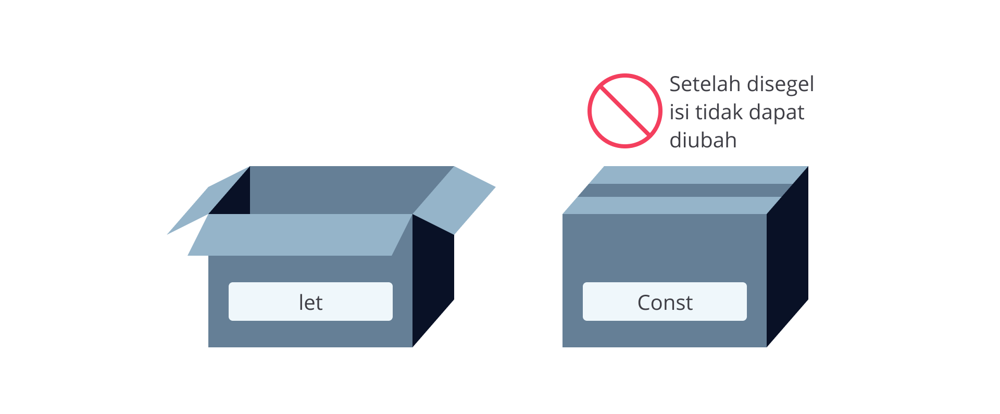

## Variable

Ketika menulis sebuah program, kita memberi tahu komputer cara memproses informasi seperti mencetak teks ke layar atau melakukan operasi perhitungan. Untuk lebih mudah dalam penggunaan dan pemanggilan data, kita bisa memanfaatkan variabel. Variabel umumnya digunakan untuk menyimpan informasi atau nilai yang akan dikelola dalam sebuah program.

Pada JavaScript setidaknya ada tiga cara untuk mendeklarasikan sebuah variabel, yaitu menggunakan keyword var, let, dan const. Pada versi ECMAScript 2015 (ES6) dikenalkan deklarasi variabel dengan let dan const untuk menggantikan var yang dinilai kontroversial dan rawan menimbulkan bug.

Dalam kelas ini, kita akan banyak menggunakan keyword let dan const. Jika Anda penasaran kenapa var sudah tidak lagi disarankan, silakan simak diskusi [berikut](https://softwareengineering.stackexchange.com/questions/274342/is-there-any-reason-to-use-the-var-keyword-in-es6).

Sekarang bagaimana caranya membuat sebuah variabel dalam JavaScript? Cukup mudah. Ketikkan keyword let yang diikuti dengan nama variabelnya.

Variabel dalam JavaScript digunakan untuk menyimpan nilai. Di JavaScript, Anda dapat mendeklarasikan variabel dengan menggunakan kata kunci `var`, `let`, atau `const`. Pada versi JavaScript yang lebih baru (ES6 dan setelahnya), lebih disarankan untuk menggunakan `let` dan `const` karena mereka memperkenalkan cakupan blok dan pengikatan nilai yang lebih ketat.

1. Menggunakan `var` (digunakan sebelum ES6, tetapi kurang disarankan sekarang):
2. Menggunakan `let` (disarankan untuk variabel yang nilainya dapat berubah):
3. Menggunakan `const` (disarankan untuk variabel yang nilainya tidak dapat berubah):

   

Variabel lastName di atas akan tersimpan di dalam memori komputer.

Setiap variabel memiliki nama yang dapat kita panggil dan gunakan. Kita dapat menamai variabel dengan nama apa pun, tetapi pastikan penamaannya masih masuk akal dengan konteksnya supaya kode mudah di- *maintenance* .

Sebaiknya hindari penamaan variabel dengan istilah umum seperti “data”. Gunakanlah penamaan variabel yang dapat mendeskripsikan nilai dari variabel itu sendiri. Berikut beberapa aturan dalam penamaan variabel yang perlu Anda ketahui:

* Harus dimulai dengan huruf atau underscore (_).
* Dapat terdiri dari huruf, angka, dan underscore (_) dengan berbagai kombinasi.
* Tidak boleh mengandung spasi (whitespace). Jika penamaan variabel lebih dari dua kata, tuliskan secara camelCase. Contoh firstName, lastName, catName, dll.
* Tidak boleh mengandung karakter spesial (! . , / \ + * = dll.)

Lalu, bagaimana dengan const? Const merupakan kependekan dari  *constant* . Artinya, kita akan mendeklarasikan sebuah variabel dengan const ketika ingin variabel bernilai konstan dan tidak bisa diubah setelah diinisialisasi nilainya. Bayangkan variabel bernilai const sebagai sebuah kotak yang ditutup dan disegel setelah diisi, sehingga nilainya tidak bisa diubah lagi.

